# 🛡️ ABC Security — Full-Cycle Security Platform Blueprint

> **Document Version:** 1.0  
> **Date:** March 10, 2026  
> **Classification:** Internal — Strategic Planning  
> **Project Codename:** ShieldSentinel

---

## 📋 Table of Contents

1. [Executive Summary](#1-executive-summary)
2. [Vision & Mission](#2-vision--mission)
3. [Platform Architecture Overview](#3-platform-architecture-overview)
4. [Feature Specifications (All 10 Features)](#4-feature-specifications)
5. [Phase-Wise Implementation Plan](#5-phase-wise-implementation-plan)
6. [AI & LLM Strategy](#6-ai--llm-strategy)
7. [Open Source Security Tools & Agents](#7-open-source-security-tools--agents)
8. [Web Platform Replication Plan](#8-web-platform-replication-plan)
9. [Cloud Hosting & Deployment Strategy](#9-cloud-hosting--deployment-strategy)
10. [Technology Stack](#10-technology-stack)
11. [Timeline & Resource Estimation](#11-timeline--resource-estimation)
12. [Risk Analysis](#12-risk-analysis)

---

## 1. Executive Summary

**ABC Security** is building a **next-generation, AI-powered, full-cycle web application security platform** that goes far beyond traditional vulnerability scanners.

Traditional scanners **only detect** vulnerabilities. ABC Security will:

```
🔍 ATTACK (Scan) → 📊 REPORT (Dashboard) → 🔧 PATCH (AI Fix) → 🛡️ DEFEND (WAF Rules)
```

This is the **first open-source platform** to provide the complete security lifecycle in one product, accessible via a **modern web interface** and deployable to the **cloud**.

### What Makes ABC Security Different

| Traditional Scanners | ABC Security Platform |
|---|---|
| Only finds vulnerabilities | Finds + Fixes + Defends |
| CLI/Desktop GUI only | Modern Web Dashboard |
| No AI intelligence | AI-powered analysis & remediation |
| DAST only (running apps) | Hybrid SAST + DAST |
| One-time scans | Continuous monitoring |
| Raw technical reports | Compliance-mapped, visual reports |
| Expert users only | Natural language chatbot for anyone |

---

## 2. Vision & Mission

### Vision
> *"Make every web application in the world secure — automatically."*

### Mission
> *"Build an AI-powered security platform that detects, explains, fixes, and defends against vulnerabilities — accessible to developers of all skill levels."*

### Core Principles
1. **Full-Cycle Security** — Don't just find problems, solve them
2. **AI-First** — Use LLMs for remediation, explanation, and automation
3. **Cloud-Native** — Deploy anywhere, access from anywhere
4. **Developer-Friendly** — If a junior developer can't use it, we've failed
5. **Open Source Core** — Community-driven innovation

---

## 3. Platform Architecture Overview

### High-Level Architecture

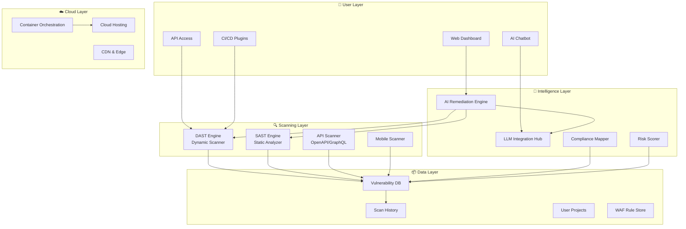

### Data Flow Diagram

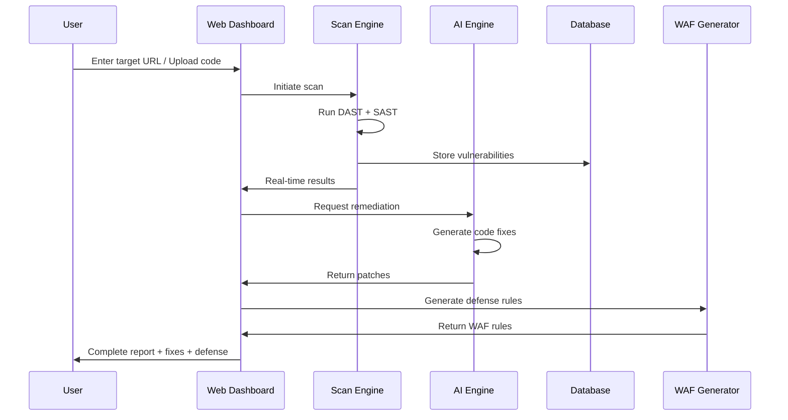

---

## 4. Feature Specifications

---

### Feature 1: 🧠 AI-Powered Auto-Remediation

#### What It Does
After detecting a vulnerability, the AI automatically generates the **exact code fix** — ready to copy-paste or auto-apply.

#### How It Works

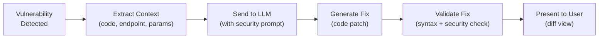

#### Example Input/Output

**Input (Vulnerability Found):**
```json
{
  "type": "SQL Injection",
  "url": "/api/users",
  "parameter": "username",
  "evidence": "query = 'SELECT * FROM users WHERE name=' + req.body.username"
}
```

**Output (AI-Generated Fix):**
```diff
- const query = 'SELECT * FROM users WHERE name=' + req.body.username;
- db.execute(query);
+ const query = 'SELECT * FROM users WHERE name = ?';
+ db.execute(query, [req.body.username]);
```

#### Technical Implementation
- **LLM Prompt Template**: Custom security-focused prompt with vulnerability context
- **Validation Layer**: Run generated fix through linting + basic security checks
- **Language Support**: JavaScript, Python, Java, PHP, Go, Ruby
- **Confidence Score**: Each fix gets a confidence percentage (e.g., 94% confident)

---

### Feature 2: 📊 Real-Time Security Dashboard

#### What It Does
A modern, beautiful web dashboard showing live scan results, trends, and security health.

#### Dashboard Layout

```
┌─────────────────────────────────────────────────────────────────┐
│  🛡️ ABC Security Dashboard                    [Scan Now] [⚙️]  │
├──────────┬──────────┬──────────┬──────────┬─────────────────────┤
│ Critical │   High   │  Medium  │   Low    │   Security Score    │
│    🔴 3  │   🟠 7   │   🟡 12  │   🟢 23  │      67/100        │
├──────────┴──────────┴──────────┴──────────┼─────────────────────┤
│                                           │                     │
│   📈 Vulnerability Trend (30 days)        │  🗺️ Attack Surface  │
│   ┌────────────────────────┐              │     Map (Graph)     │
│   │    ╱╲                  │              │                     │
│   │   ╱  ╲    ╱╲           │              │   [node]--[node]    │
│   │  ╱    ╲──╱  ╲──        │              │     |       |       │
│   │ ╱              ╲───    │              │   [node]  [node]    │
│   └────────────────────────┘              │                     │
│                                           │                     │
├───────────────────────────────────────────┴─────────────────────┤
│  Recent Vulnerabilities                                         │
│  ┌────┬──────────────────┬──────────┬────────┬────────────────┐ │
│  │ ID │ Type             │ Severity │ Status │ AI Fix Ready?  │ │
│  ├────┼──────────────────┼──────────┼────────┼────────────────┤ │
│  │ 01 │ SQL Injection    │ Critical │ Open   │ ✅ Yes         │ │
│  │ 02 │ XSS (Reflected)  │ High     │ Open   │ ✅ Yes         │ │
│  │ 03 │ Missing CSP      │ Medium   │ Fixed  │ ✅ Yes         │ │
│  └────┴──────────────────┴──────────┴────────┴────────────────┘ │
└─────────────────────────────────────────────────────────────────┘
```

#### Technical Implementation
- **Frontend**: React.js / Next.js with Chart.js or Recharts
- **Real-time**: WebSocket connection for live scan updates
- **Theming**: Dark mode default, glass-morphism design
- **Responsive**: Works on desktop, tablet, mobile

---

### Feature 3: 🔗 Hybrid SAST + DAST Scanning

#### What It Does
Combines static source code analysis WITH dynamic runtime testing, then **correlates** findings.

#### How Correlation Works

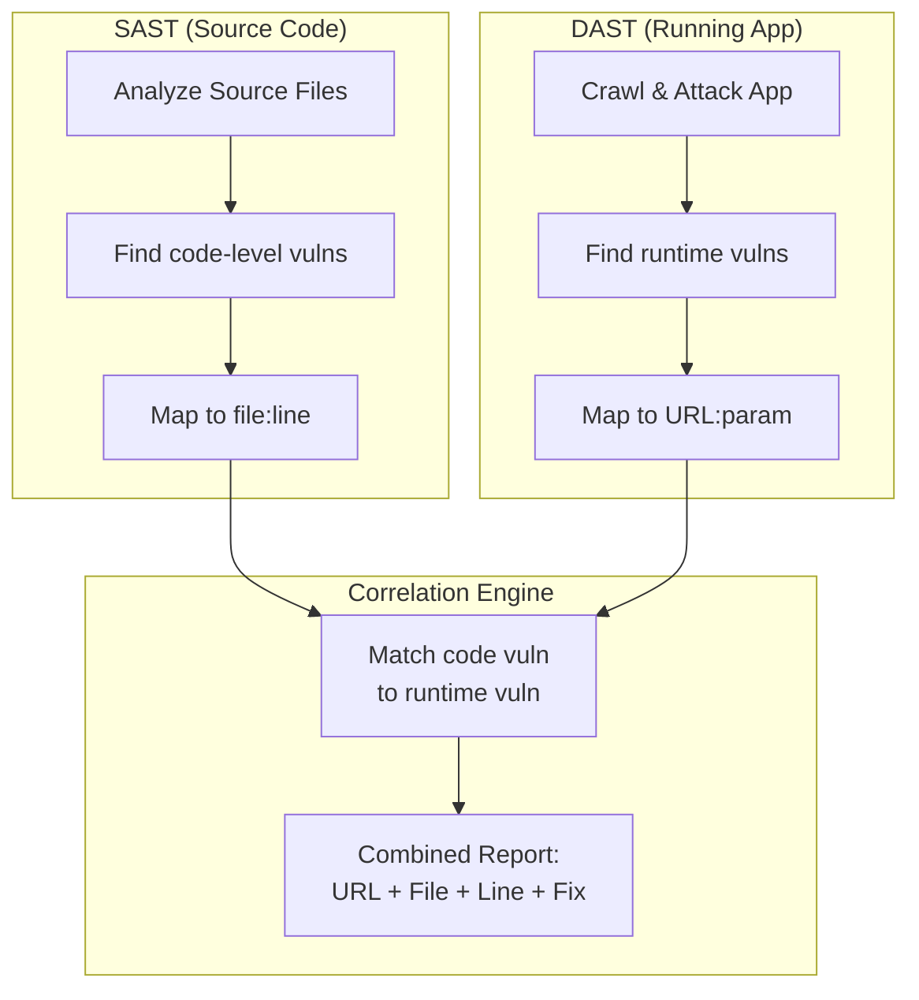

#### Example Correlated Output
```
╔══════════════════════════════════════════════════════════════════╗
║  CORRELATED VULNERABILITY #1                                    ║
╠══════════════════════════════════════════════════════════════════╣
║  Type:     Cross-Site Scripting (XSS)                           ║
║  Severity: HIGH                                                 ║
║                                                                 ║
║  DAST Finding:                                                  ║
║  → URL: https://app.com/profile?name=<script>alert(1)</script>  ║
║  → Parameter: name                                              ║
║  → Evidence: Script executed in response                        ║
║                                                                 ║
║  SAST Finding:                                                  ║
║  → File: src/controllers/ProfileController.js                   ║
║  → Line: 47                                                     ║
║  → Code: res.send(`<h1>Hello ${req.query.name}</h1>`)           ║
║                                                                 ║
║  AI Fix:                                                        ║
║  → Replace with: res.send(`<h1>Hello ${escape(req.query.name)}  ║
║    </h1>`)                                                      ║
╚══════════════════════════════════════════════════════════════════╝
```

#### Tools to Leverage
| Component | Tool | License |
|---|---|---|
| SAST Engine | Semgrep OSS | LGPL-2.1 (Free) |
| DAST Engine | Custom (inspired by ZAP) | Your own |
| Correlation | Custom matching algorithm | Your own |

---

### Feature 4: 🤖 AI Security Chatbot / Copilot

#### What It Does
Natural language interface — users ask questions in plain English instead of navigating complex menus.

#### Conversation Examples

```
👤 User: "Scan my website at https://myapp.com"
🤖 ABC: "Starting scan of https://myapp.com... 
         Found 47 endpoints. Running security tests.
         Initial results: 2 Critical, 5 High vulnerabilities found.
         Would you like me to show details or generate fixes?"

👤 User: "What's the most dangerous issue?"
🤖 ABC: "The most critical issue is an SQL Injection vulnerability 
         on your login page (/api/auth/login). An attacker could 
         extract your entire database through the 'email' parameter.
         I've generated a fix — want me to show it?"

👤 User: "Explain it like I'm a junior developer"
🤖 ABC: "Think of it like this: Your code takes whatever the user 
         types in the email field and puts it directly into a database 
         command. A hacker can type special database commands instead 
         of an email, and your app will execute them. The fix is to 
         use 'parameterized queries' that treat user input as data, 
         never as commands."

👤 User: "Generate a report for my manager"
🤖 ABC: "📄 Executive Report Generated:
         - Security Score: 62/100 (Needs Improvement)
         - 2 Critical issues requiring immediate attention
         - Estimated fix time: 4 hours
         - Download: [PDF] [HTML] [JSON]"
```

#### Technical Implementation

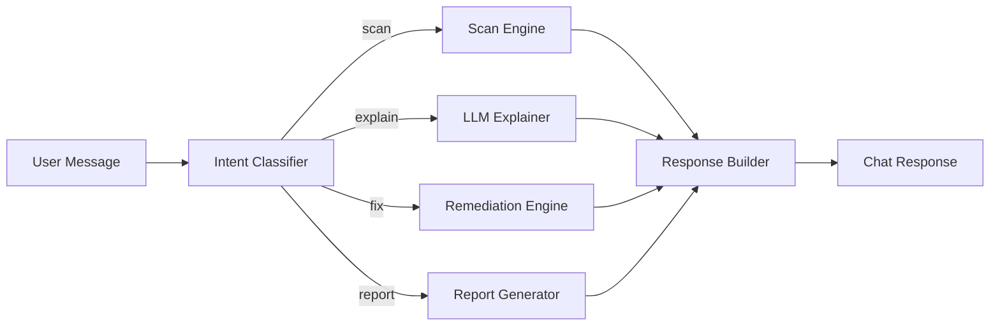

---

### Feature 5: 🛡️ Auto-Generated WAF Rules

#### What It Does
For every vulnerability found, generates ready-to-deploy firewall rules.

#### Supported Platforms
| Platform | Rule Format |
|---|---|
| Nginx + ModSecurity | SecRule directives |
| Apache + ModSecurity | SecRule directives |
| AWS WAF | JSON rule groups |
| Cloudflare | Firewall rule expressions |
| Azure WAF | Custom rules |

#### Example Output

**Vulnerability Found:** Path Traversal on `/api/files?path=../../etc/passwd`

**Generated Rules:**

```apache
# ModSecurity Rule (Nginx/Apache)
SecRule ARGS:path "@rx \.\.[\\/]" \
    "id:100001,\
     phase:1,\
     deny,\
     status:403,\
     msg:'Path Traversal Attempt Blocked by ABC Security',\
     tag:'ABC-VULN-PT-001'"
```

```json
// AWS WAF Rule
{
  "Name": "ABC-Block-PathTraversal",
  "Priority": 1,
  "Statement": {
    "ByteMatchStatement": {
      "SearchString": "..",
      "FieldToMatch": {
        "QueryString": {}
      },
      "TextTransformations": [
        { "Priority": 0, "Type": "URL_DECODE" }
      ],
      "PositionalConstraint": "CONTAINS"
    }
  },
  "Action": { "Block": {} }
}
```

```
# Cloudflare Firewall Rule
(http.request.uri.query contains ".." and http.request.uri.path contains "/api/files")
→ Action: Block
```

---

### Feature 6: ⚡ CI/CD Pipeline Integration with Quality Gates

#### What It Does
Integrates into GitHub Actions, GitLab CI, Jenkins to **block insecure deployments**.

#### Pipeline Flow

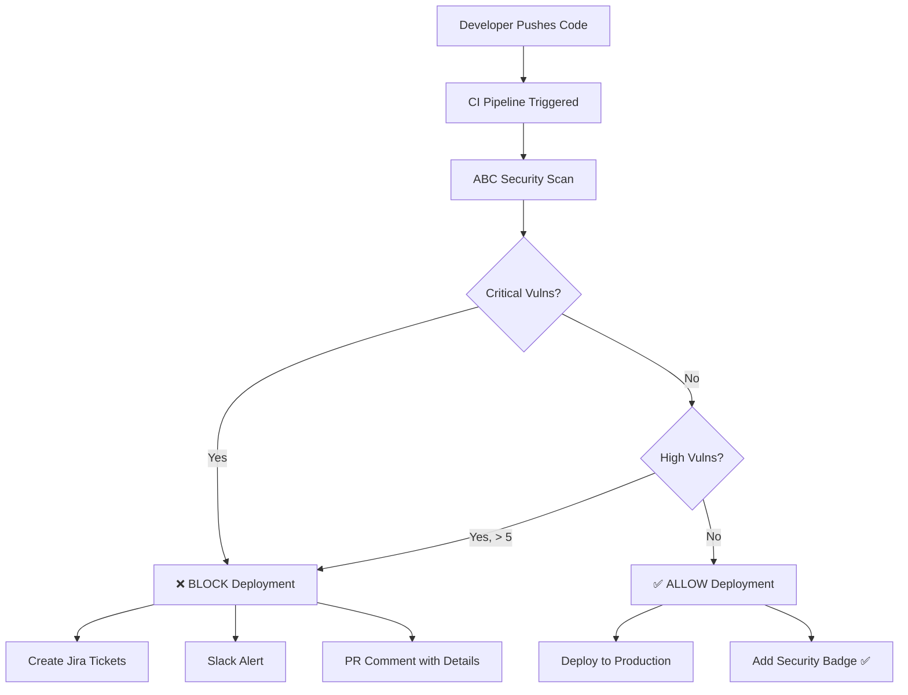

#### GitHub Actions Example
```yaml
# .github/workflows/security.yml
name: ABC Security Gate
on: [push, pull_request]

jobs:
  security-scan:
    runs-on: ubuntu-latest
    steps:
      - uses: actions/checkout@v4
      - name: Run ABC Security Scan
        uses: abc-security/scan-action@v1
        with:
          target: ${{ env.APP_URL }}
          scan-type: hybrid  # SAST + DAST
          fail-on: critical  # Block on critical vulns
          
      - name: Post Results to PR
        uses: abc-security/pr-comment@v1
        with:
          github-token: ${{ secrets.GITHUB_TOKEN }}
```

---

### Feature 7: 📱 Mobile App Security Testing

#### What It Does
Intercepts and analyzes mobile app traffic for security vulnerabilities.

#### Capabilities
- Certificate pinning detection
- Insecure API calls identification
- Hardcoded secrets/keys detection
- Insecure data storage analysis
- Authentication flow testing

#### Architecture

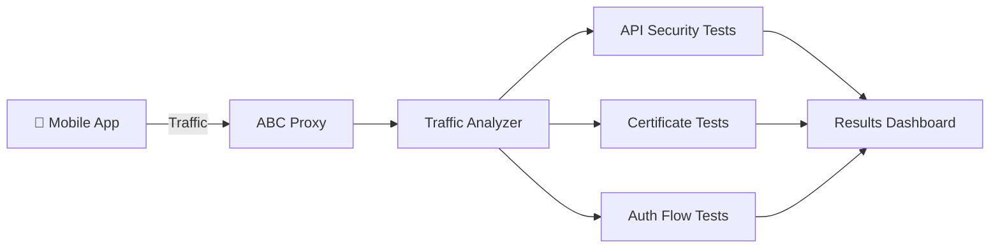

---

### Feature 8: 🗺️ Visual Attack Surface Mapping

#### What It Does
Creates an interactive visual graph of all discovered endpoints, showing relationships and risk levels.

#### Visual Representation
```
                    🌐 https://app.com
                    ┌───────┴───────┐
                /api                /admin
          ┌──────┼──────┐           ┌──┴──┐
        /users  /auth  /files     /login  /panel
        🟢     🔴      🔴         🟠      🟡
        │       │       │          │       │
      GET,POST POST   GET,DEL    POST    GET
      
    🔴 = Critical vulns    🟠 = High vulns
    🟡 = Medium vulns      🟢 = Safe
```

#### Interactive Features
- Click any node to see vulnerability details
- Zoom in/out on specific areas
- Filter by severity level
- Show data flow between endpoints
- Export as image or interactive HTML

---

### Feature 9: 📋 Compliance Mapping

#### What It Does
Maps every vulnerability to compliance standards automatically.

#### Mapping Table
| Vulnerability | OWASP Top 10 | PCI-DSS | GDPR | HIPAA |
|---|---|---|---|---|
| SQL Injection | A03:2021 Injection | Req 6.5.1 | Art. 32 | §164.312(a) |
| XSS | A03:2021 Injection | Req 6.5.7 | Art. 32 | §164.312(a) |
| Broken Auth | A07:2021 Auth Failures | Req 8.1 | Art. 32 | §164.312(d) |
| Data Exposure | A02:2021 Crypto Failures | Req 3.4 | Art. 5(1)(f) | §164.312(e) |
| Missing HTTPS | A02:2021 Crypto Failures | Req 4.1 | Art. 32 | §164.312(e) |

#### Compliance Dashboard
```
╔═══════════════════════════════════════════════╗
║  📋 Compliance Readiness                      ║
╠═══════════════════════════════════════════════╣
║                                               ║
║  OWASP Top 10:  ████████░░ 78%               ║
║  PCI-DSS:       ██████░░░░ 62%               ║
║  GDPR:          █████████░ 91%               ║
║  HIPAA:         ███████░░░ 73%               ║
║                                               ║
║  ⚠️ Fix 4 critical issues to reach            ║
║     PCI-DSS compliance                        ║
╚═══════════════════════════════════════════════╝
```

---

### Feature 10: 🔄 Continuous Monitoring & Regression Detection

#### What It Does
Schedules automatic scans and tracks vulnerability lifecycle.

#### Lifecycle Flow

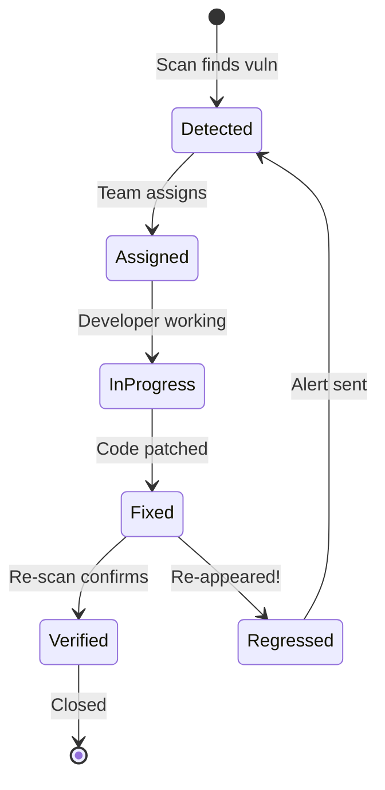

#### Features
- **Scheduled Scans**: Daily, weekly, monthly
- **Regression Alerts**: Email/Slack when fixed vuln reappears
- **Trend Analysis**: "Vulnerabilities decreased 34% this month"
- **SLA Tracking**: "Critical vulns must be fixed within 48 hours"

---

## 5. Phase-Wise Implementation Plan

### Overview

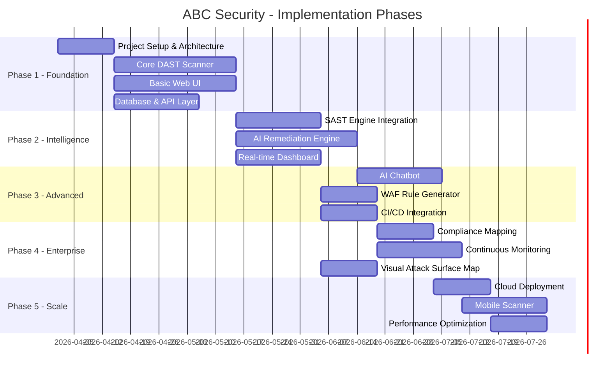

---

### 📦 Phase 1: Foundation (Weeks 1-8)
> *Goal: Build the core scanning engine and basic web interface*

#### Tasks

| # | Task | Description | Duration |
|---|---|---|---|
| 1.1 | Project Setup | Initialize Next.js project, configure DB, set up monorepo | 1 week |
| 1.2 | Core DAST Engine | Build HTTP proxy, crawler/spider, request interceptor | 4 weeks |
| 1.3 | Basic Scan Rules | SQL Injection, XSS, Path Traversal, Open Redirect (top 10) | 2 weeks |
| 1.4 | REST API Backend | Node.js/Express or Python/FastAPI — scan management endpoints | 2 weeks |
| 1.5 | Basic Web UI | Project creation, target input, scan list, simple results table | 3 weeks |
| 1.6 | Database Layer | PostgreSQL schema for projects, scans, vulnerabilities | 1 week |
| 1.7 | Authentication | User signup/login with JWT | 1 week |

#### Architecture for Phase 1

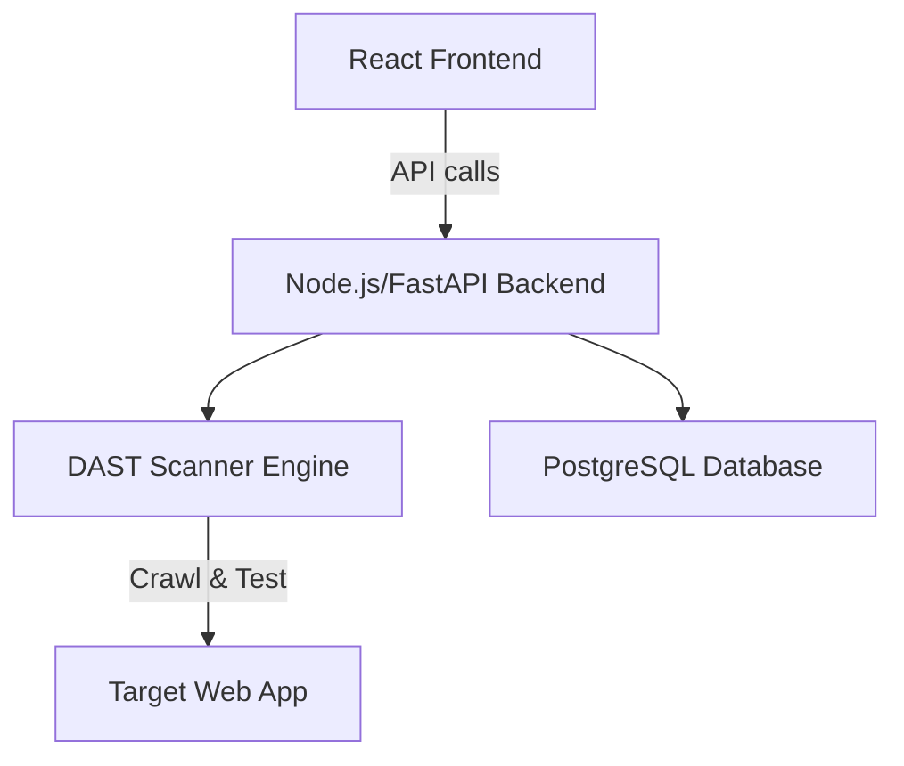

#### Key Deliverables
- ✅ User can sign up and create a project
- ✅ User can enter a URL and start a scan
- ✅ Scanner crawls the target and finds basic vulnerabilities
- ✅ Results displayed in a simple table

---

### 🧠 Phase 2: Intelligence Layer (Weeks 9-14)
> *Goal: Add AI-powered features and beautiful dashboard*

#### Tasks

| # | Task | Description | Duration |
|---|---|---|---|
| 2.1 | SAST Engine | Integrate Semgrep for source code scanning | 2 weeks |
| 2.2 | SAST-DAST Correlation | Build matching engine to link runtime vulns to code | 1 week |
| 2.3 | AI Remediation Engine | LLM integration for auto-generating code fixes | 4 weeks |
| 2.4 | Real-Time Dashboard | Charts, trends, security score, WebSocket live updates | 3 weeks |
| 2.5 | Report Generation | PDF/HTML/JSON reports with branding | 1 week |

#### AI Remediation Architecture

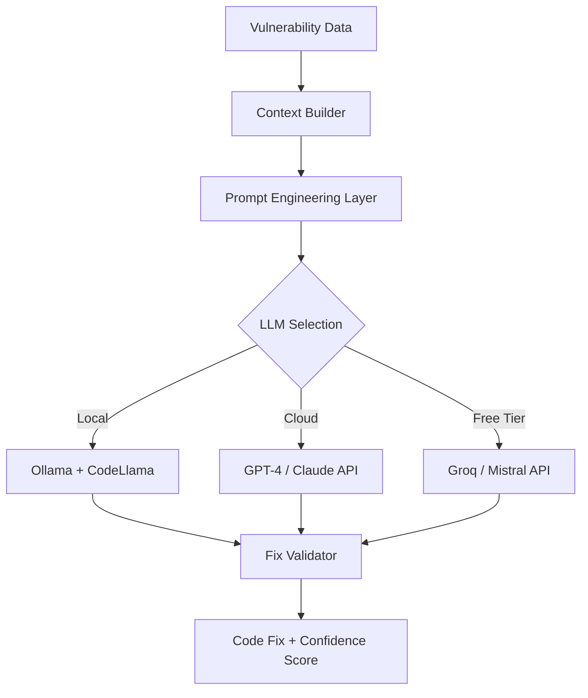

#### Key Deliverables
- ✅ Source code upload and SAST scanning works
- ✅ Vulnerabilities are correlated between SAST and DAST
- ✅ AI generates code fixes for detected vulnerabilities
- ✅ Beautiful dashboard with charts and real-time updates

---

### ⚡ Phase 3: Advanced Features (Weeks 15-20)
> *Goal: Add chatbot, WAF rules, and CI/CD integration*

#### Tasks

| # | Task | Description | Duration |
|---|---|---|---|
| 3.1 | AI Security Chatbot | Natural language interface with conversation history | 3 weeks |
| 3.2 | WAF Rule Generator | Auto-generate ModSecurity, AWS WAF, Cloudflare rules | 2 weeks |
| 3.3 | CI/CD Integration | GitHub Actions, GitLab CI plugins, webhooks | 2 weeks |
| 3.4 | Notification System | Email, Slack, Teams, Discord integrations | 1 week |

#### Key Deliverables
- ✅ Users can chat with AI about their security findings
- ✅ WAF rules generated automatically for each vulnerability
- ✅ GitHub Actions plugin available for CI/CD integration
- ✅ Slack alerts for critical findings

---

### 🏢 Phase 4: Enterprise Features (Weeks 21-26)
> *Goal: Add compliance, monitoring, and visualization*

#### Tasks

| # | Task | Description | Duration |
|---|---|---|---|
| 4.1 | Compliance Engine | OWASP, PCI-DSS, GDPR, HIPAA mapping | 2 weeks |
| 4.2 | Continuous Monitoring | Scheduled scans, regression detection | 3 weeks |
| 4.3 | Attack Surface Map | Interactive D3.js/Cytoscape.js graph visualization | 2 weeks |
| 4.4 | Team Collaboration | Multi-user projects, roles, assignments | 2 weeks |

#### Key Deliverables
- ✅ Compliance readiness percentages for all standards
- ✅ Automated scheduled scans with alerts
- ✅ Visual interactive attack surface graph
- ✅ Team features: roles, assignments, comments

---

### ☁️ Phase 5: Scale & Deploy (Weeks 27-32)
> *Goal: Cloud deployment, mobile scanner, optimization*

#### Tasks

| # | Task | Description | Duration |
|---|---|---|---|
| 5.1 | Cloud Deployment | Docker, Kubernetes, CI/CD for the platform itself | 2 weeks |
| 5.2 | Mobile Scanner | Proxy-based mobile app testing | 3 weeks |
| 5.3 | Performance | Caching, parallel scanning, rate limiting | 2 weeks |
| 5.4 | Documentation | User docs, API docs, video tutorials | 1 week |

---

## 6. AI & LLM Strategy

### Which LLM to Use?

This is the **most important decision** for the AI features. Here's a detailed comparison:

---

### Option A: Local LLMs (Self-Hosted — Most Private)

| Model | Size | Best For | How to Run |
|---|---|---|---|
| **CodeLlama 13B** | 7 GB | Code fix generation | Ollama |
| **Mistral 7B** | 4 GB | General explanations | Ollama |
| **DeepSeek Coder V2** | 8 GB | Code analysis | Ollama |
| **Llama 3 8B** | 5 GB | Chatbot responses | Ollama |
| **StarCoder2 7B** | 4 GB | Multi-lang code fixes | Ollama |

#### How to Set Up Local LLM

```bash
# Install Ollama (macOS/Linux)
curl -fsSL https://ollama.com/install.sh | sh

# Pull a model
ollama pull codellama:13b
ollama pull mistral:7b

# Use in your code (REST API)
curl http://localhost:11434/api/generate -d '{
  "model": "codellama:13b",
  "prompt": "Fix this SQL injection: query = \"SELECT * FROM users WHERE id=\" + userId"
}'
```

#### Pros & Cons
| ✅ Pros | ❌ Cons |
|---|---|
| Complete data privacy | Slower (depends on hardware) |
| No API costs | Needs GPU for best performance |
| Works offline | Smaller models = lower quality |
| No rate limits | Requires 8-16 GB RAM minimum |

> **Best for:** Security-sensitive environments, data privacy compliance, no budget for API costs

---

### Option B: Cloud LLM APIs (Best Quality)

| Provider | Model | Free Tier? | Cost | Quality |
|---|---|---|---|---|
| **OpenAI** | GPT-4o | No | $2.50/M input tokens | ⭐⭐⭐⭐⭐ |
| **Anthropic** | Claude 3.5 Sonnet | No | $3.00/M input tokens | ⭐⭐⭐⭐⭐ |
| **Google** | Gemini Pro | ✅ Yes (60 RPM) | Free → $0.50/M | ⭐⭐⭐⭐ |
| **Groq** | Llama 3 70B | ✅ Yes (30 RPM) | Free tier available | ⭐⭐⭐⭐ |
| **Mistral AI** | Mistral Large | ✅ Yes (limited) | Free → $2.00/M | ⭐⭐⭐⭐ |
| **Together AI** | Various OSS | ✅ Yes ($25 credit) | $0.20/M | ⭐⭐⭐⭐ |
| **OpenRouter** | All models | ✅ Yes (limited) | Varies | ⭐⭐⭐⭐ |

> **Best for:** Highest quality output, no hardware requirements, quick setup

---

### Option C: Hybrid (RECOMMENDED ✅)

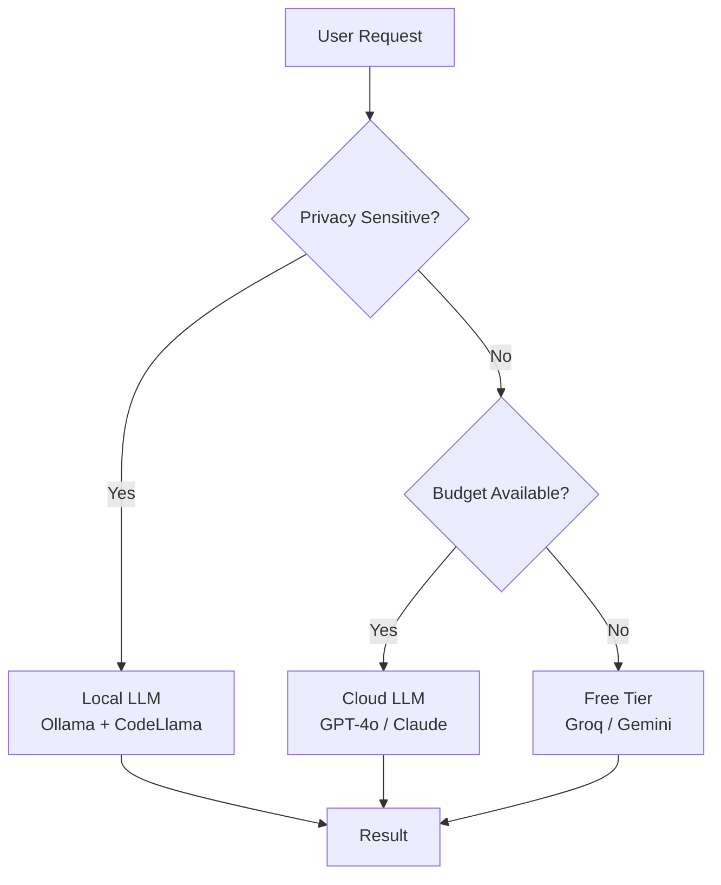

**Recommended Strategy:**
1. **Default**: Use **Groq API** (free tier, Llama 3 70B — very fast)
2. **Premium users**: Use **GPT-4o or Claude** for highest quality
3. **Self-hosted option**: Let users connect their own **Ollama** instance
4. **Fallback chain**: Groq → Gemini → Local Ollama

#### Implementation Code Pattern

```javascript
// LLM Hub - Smart routing
class LLMHub {
  async generateFix(vulnerability, userPreference = 'auto') {
    const providers = {
      'local': () => this.callOllama(vulnerability),
      'groq': () => this.callGroq(vulnerability),     // Free
      'gemini': () => this.callGemini(vulnerability),  // Free tier
      'openai': () => this.callOpenAI(vulnerability),  // Paid
      'claude': () => this.callClaude(vulnerability),  // Paid
    };
    
    if (userPreference === 'auto') {
      // Try free options first, fallback to paid
      const chain = ['groq', 'gemini', 'local'];
      for (const provider of chain) {
        try {
          return await providers[provider]();
        } catch (e) {
          console.log(`${provider} failed, trying next...`);
        }
      }
    }
    
    return await providers[userPreference]();
  }
}
```

---

## 7. Open Source Security Tools & Agents

### Free & Open Source Tools to Integrate

| Tool | What It Does | License | How to Use |
|---|---|---|---|
| **Semgrep OSS** | SAST — Static code analysis | LGPL-2.1 | CLI / API — scan source code |
| **OWASP ZAP** | DAST — Dynamic scanning | Apache 2.0 | Headless mode via API |
| **Nuclei** | Vulnerability scanner with templates | MIT | CLI — template-based scanning |
| **Nikto** | Web server scanner | GPL | CLI — server misconfig detection |
| **SQLMap** | SQL injection detection | GPL | CLI — deep SQLi testing |
| **Wapiti** | Web app vulnerability scanner | GPL-2.0 | CLI / Python |
| **Trivy** | Container & code vulnerability scanner | Apache 2.0 | CLI — scan Docker images |
| **Bandit** | Python SAST | Apache 2.0 | CLI — Python-specific analysis |
| **ESLint Security** | JavaScript SAST | MIT | npm — JS-specific rules |
| **Gitleaks** | Secret detection | MIT | CLI — find hardcoded passwords |

### AI Security Agents (Open Source)

| Agent | What It Does | Status |
|---|---|---|
| **PentestGPT** | AI-guided penetration testing | Open source, GPT-powered |
| **BurpGPT** | AI analysis for Burp Suite | Open source plugin |
| **ReconAIzer** | AI-powered reconnaissance | Open source |
| **Nuclei AI** | AI template generation for Nuclei | Community project |
| **SecGPT** | Security-focused LLM agent | Research project |

### Integration Architecture

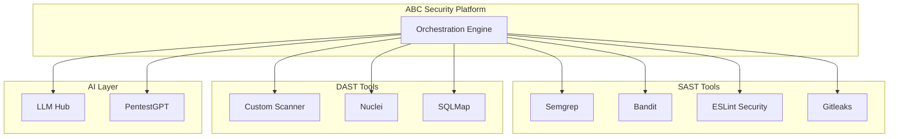

---

## 8. Web Platform Replication Plan

### How to Replicate This Entire Project as a Website

#### Overall Web Architecture

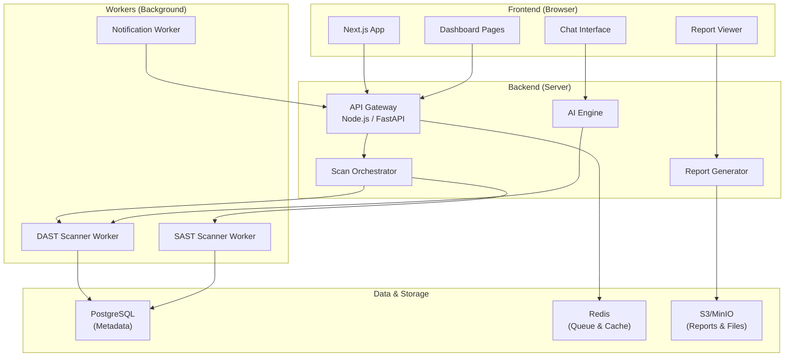

#### Website Page Structure

```
/                       → Landing page (marketing)
/login                  → Authentication
/signup                 → Registration
/dashboard              → Main dashboard (security overview)
/dashboard/scans        → All scans list
/dashboard/scan/:id     → Individual scan results
/dashboard/scan/:id/fix → AI-generated fixes
/dashboard/projects     → Project management
/dashboard/reports      → Generated reports
/dashboard/compliance   → Compliance readiness
/dashboard/map          → Attack surface visualization
/dashboard/monitor      → Continuous monitoring
/dashboard/settings     → User & project settings
/chat                   → AI Security Chatbot
/api/v1/*               → REST API endpoints
```

#### Phase-by-Phase Web Build

**Web Phase 1 — Landing + Auth + Basic Scanning**
```bash
# Initialize Project
npx -y create-next-app@latest abc-security --typescript --tailwind --app --src-dir

# Install dependencies
npm install @prisma/client prisma          # Database ORM
npm install next-auth                       # Authentication
npm install axios                           # HTTP client
npm install recharts                        # Charts
npm install socket.io socket.io-client      # Real-time
npm install lucide-react                    # Icons
```

**Web Phase 2 — Dashboard + AI Integration**
```bash
npm install openai                          # OpenAI SDK
npm install @anthropic-ai/sdk               # Claude SDK
npm install groq-sdk                        # Groq SDK (free)
npm install @react-three/fiber              # 3D viz (optional)
npm install d3                              # Data visualization
npm install react-markdown                  # Markdown rendering
npm install framer-motion                   # Animations
```

**Web Phase 3 — Advanced Features**
```bash
npm install @slack/web-api                  # Slack integration
npm install nodemailer                      # Email notifications
npm install cytoscape                       # Graph visualization
npm install react-pdf-renderer              # PDF reports
npm install bull                            # Job queue
```

---

## 9. Cloud Hosting & Deployment Strategy

### Recommended Cloud Setup

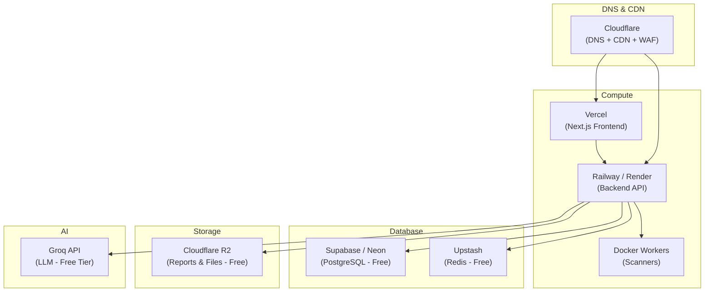

### Free Tier Cloud Options

| Service | Purpose | Free Tier |
|---|---|---|
| **Vercel** | Frontend hosting | 100 GB bandwidth/month |
| **Railway** | Backend hosting | $5/month credit |
| **Render** | Backend hosting | 750 hours/month |
| **Supabase** | PostgreSQL database | 500 MB, 2 projects |
| **Neon** | PostgreSQL database | 512 MB, unlimited |
| **Upstash** | Redis cache/queue | 10K commands/day |
| **Cloudflare R2** | File storage | 10 GB storage, 10M reads |
| **Groq** | LLM API | 30 RPM, 6000 TPM |
| **Google Gemini** | LLM API | 60 RPM free |
| **GitHub Actions** | CI/CD | 2000 min/month |

### Docker Deployment

```dockerfile
# Dockerfile for ABC Security Backend
FROM node:20-alpine

WORKDIR /app

# Install security tools
RUN apk add --no-cache python3 py3-pip
RUN pip3 install semgrep

COPY package*.json ./
RUN npm ci --production

COPY . .
RUN npm run build

EXPOSE 3001
CMD ["npm", "start"]
```

```yaml
# docker-compose.yml
version: '3.8'
services:
  frontend:
    build: ./frontend
    ports:
      - "3000:3000"
    environment:
      - API_URL=http://backend:3001
      
  backend:
    build: ./backend
    ports:
      - "3001:3001"
    environment:
      - DATABASE_URL=postgresql://postgres:pass@db:5432/abc
      - REDIS_URL=redis://redis:6379
      - GROQ_API_KEY=${GROQ_API_KEY}
    depends_on:
      - db
      - redis
      
  scanner-worker:
    build: ./scanner
    environment:
      - REDIS_URL=redis://redis:6379
    depends_on:
      - redis
      
  db:
    image: postgres:16-alpine
    environment:
      - POSTGRES_DB=abc
      - POSTGRES_PASSWORD=pass
    volumes:
      - pgdata:/var/lib/postgresql/data
      
  redis:
    image: redis:7-alpine
    
volumes:
  pgdata:
```

---

## 10. Technology Stack

### Complete Stack Overview

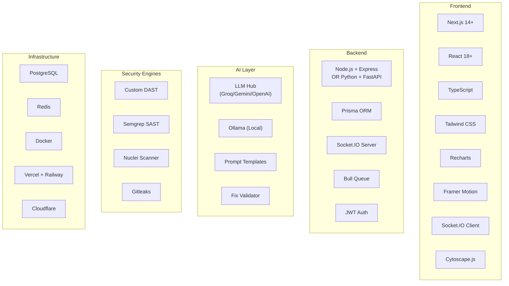

### Stack Summary Table

| Layer | Technology | Why |
|---|---|---|
| **Frontend** | Next.js + React + TypeScript | Best DX, SSR, great ecosystem |
| **Styling** | Tailwind CSS + Framer Motion | Beautiful, fast, animated |
| **Charts** | Recharts + D3.js | Professional data visualization |
| **Graph Viz** | Cytoscape.js | Interactive attack surface maps |
| **Backend** | Node.js/Express OR Python/FastAPI | Fast, async, great for APIs |
| **Database** | PostgreSQL (Prisma ORM) | Reliable, free options available |
| **Cache/Queue** | Redis + Bull | Background scan jobs |
| **Real-time** | Socket.IO | Live scan updates |
| **Auth** | NextAuth.js + JWT | Simple, secure auth |
| **AI** | Groq (free) + Ollama (local) | Best quality-to-cost ratio |
| **SAST** | Semgrep | Industry standard, free |
| **Secrets** | Gitleaks | Best secret detection |
| **Deploy** | Docker + Vercel + Railway | Free tiers, easy scaling |
| **CDN** | Cloudflare | Free CDN + DNS + security |

---

## 11. Timeline & Resource Estimation

### Overall Timeline

| Phase | Duration | Focus |
|---|---|---|
| **Phase 1** | Weeks 1-8 | Foundation: Scanner + Basic UI |
| **Phase 2** | Weeks 9-14 | Intelligence: AI + Dashboard |
| **Phase 3** | Weeks 15-20 | Advanced: Chatbot + WAF + CI/CD |
| **Phase 4** | Weeks 21-26 | Enterprise: Compliance + Monitoring |
| **Phase 5** | Weeks 27-32 | Scale: Cloud + Mobile + Polish |
| **Total** | **~8 months** | **Full platform** |

### MVP (Minimum Viable Product) Timeline

If you want something **working quickly**, focus on:

| Feature | Duration | Priority |
|---|---|---|
| Basic scanner (DAST) | 3 weeks | P0 |
| Web UI (dashboard) | 2 weeks | P0 |
| AI Remediation | 2 weeks | P0 |
| Reports | 1 week | P1 |
| **MVP Total** | **~8 weeks** | — |

### Cost Estimation (Starting)

| Item | Cost | Notes |
|---|---|---|
| Cloud Hosting | **$0/month** | Free tiers (Vercel + Railway + Supabase) |
| AI/LLM | **$0/month** | Groq free tier + Ollama local |
| Domain | **$12/year** | One-time domain purchase |
| SSL | **$0** | Cloudflare free |
| **Total to Start** | **~$12/year** | Almost entirely free! |

---

## 12. Risk Analysis

| Risk | Impact | Mitigation |
|---|---|---|
| AI generates incorrect fixes | High | Validation layer + confidence scores + human review |
| Free tier API limits reached | Medium | Implement caching + fallback chain |
| Scanner causes DoS on target | High | Rate limiting + careful crawling |
| False positives overwhelm users | Medium | ML-based confidence scoring |
| Users scan sites they don't own | High | ToS + target ownership verification |
| Security of the platform itself | Critical | Regular self-scanning + security headers |

---

## 🎯 Quick Start Checklist

```
□ Week 1: Set up Next.js + PostgreSQL + Docker
□ Week 2: Build basic DAST scanner (HTTP requests)
□ Week 3: Add 5 core scan rules (SQLi, XSS, etc.)
□ Week 4: Build dashboard with results table
□ Week 5: Integrate Groq API for AI fixes
□ Week 6: Add real-time scan progress (WebSocket)
□ Week 7: Build report generator (PDF/HTML)
□ Week 8: Deploy MVP to Vercel + Railway
□ Week 9: Start SAST integration (Semgrep)
□ Week 10: Build AI chatbot interface
```

---

> **Document prepared by:** ABC Security Team  
> **Version:** 1.0  
> **Date:** March 10, 2026  
> **Next Review:** April 10, 2026

---

*This document is confidential and intended for internal use only.*
