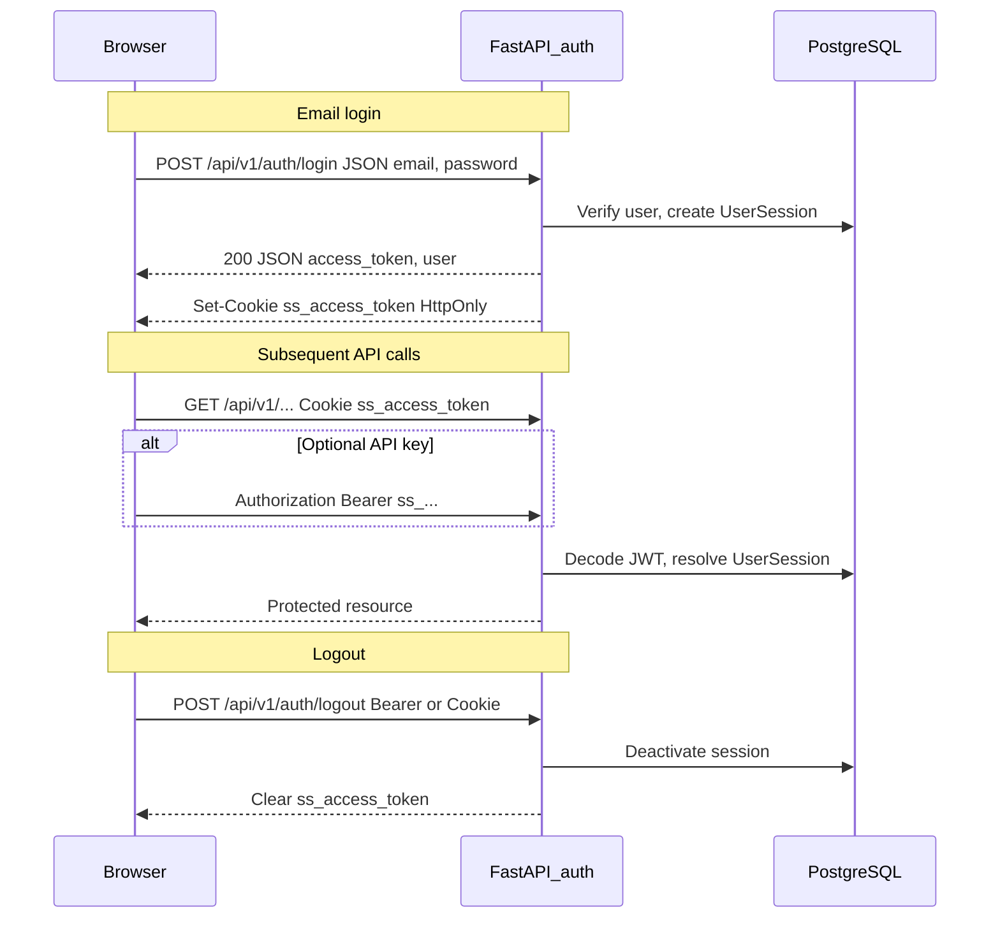
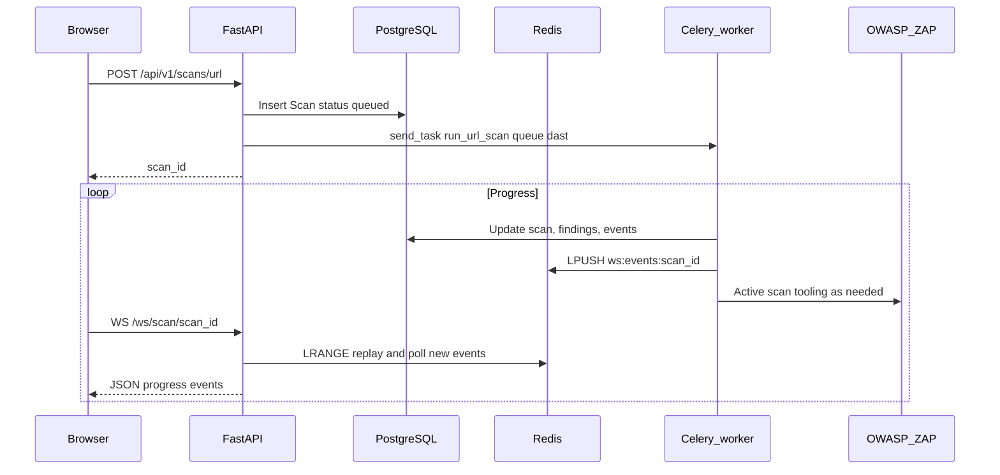
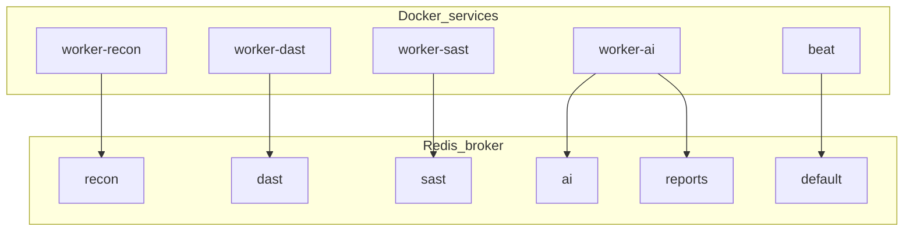
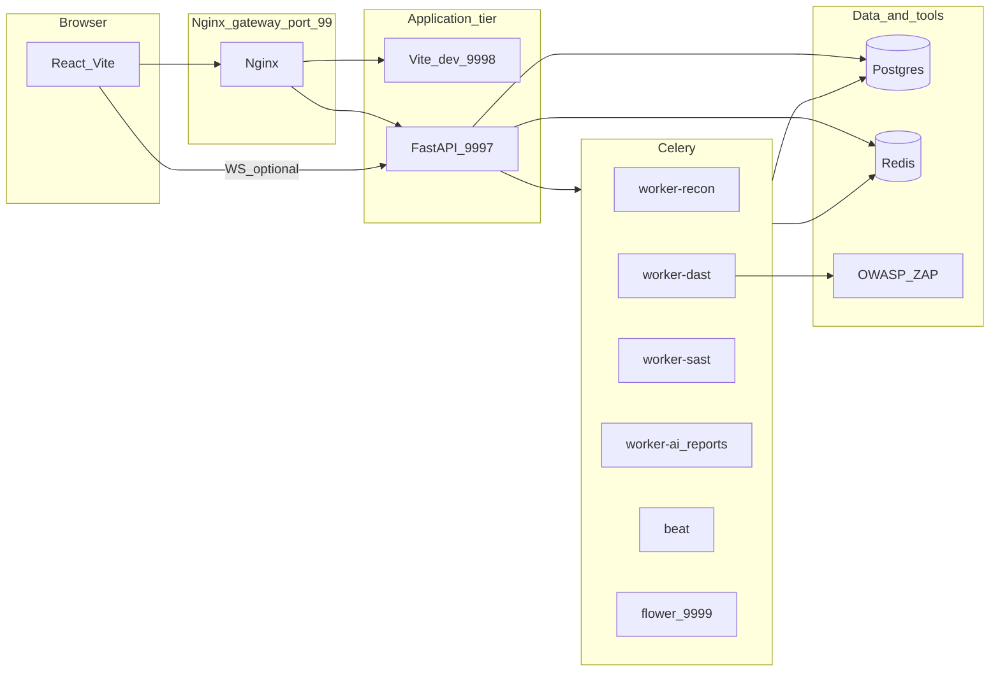
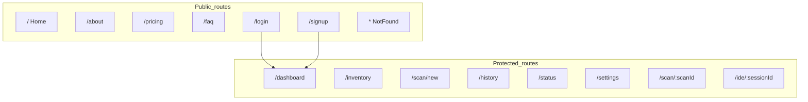
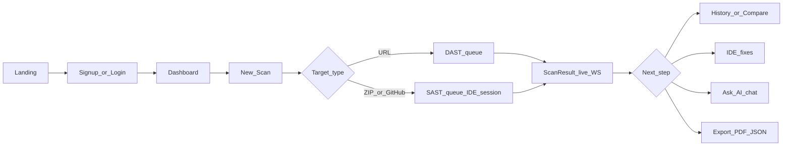

# SecureWithAI / ShieldSentinel — Comprehensive Project Report

This document describes the **SecureWithAI** repository: a full-stack security assessment product branded **ShieldSentinel** in the UI and API. It covers repository layout, user navigation, authentication, REST and WebSocket behavior, asynchronous scanning pipelines, scanner tooling, operations, and data evolution.

---

## 1. Product and technology stack

**ShieldSentinel** is a web application for security testing: users can run **URL (DAST-style)** scans, **ZIP** and **GitHub** **SAST** scans, review findings and compliance data, compare scans, schedule recurring scans, export reports (PDF/JSON), chat with an LLM about results, and use an in-browser **IDE** (Monaco) tied to repository or ZIP-derived code.

| Layer | Technologies |
|--------|----------------|
| **Frontend** | React 18, Vite, TypeScript, React Router, TanStack Query, Axios (`withCredentials`), Google OAuth (`@react-oauth/google`), Framer Motion, Recharts, Monaco Editor, React Markdown, Tailwind-style utility classes |
| **Backend** | Python 3, FastAPI, Uvicorn, SQLAlchemy, Alembic, Pydantic, Redis (async + sync), HTTPX |
| **Workers** | Celery, Redis broker/backend, named queues: `recon`, `dast`, `sast`, `ai`, `reports`, `default` |
| **Data** | PostgreSQL 15 |
| **External scanners** | OWASP ZAP (daemon), plus many CLI-integrated tools under [`backend/api/packages/scanner`](backend/api/packages/scanner) |
| **Edge** | Nginx gateway (rate limits, `/api`, `/ws`, static app proxy) |

---

## 2. Repository directory map

### 2.1 High-level areas

| Area | Purpose |
|------|---------|
| [`frontend/`](frontend/) | Vite React SPA; source under [`frontend/src`](frontend/src) |
| [`backend/api/`](backend/api/) | FastAPI app (`main.py`), routers, models, workers, Alembic, packages |
| [`backend/packages/`](backend/packages/) | Additional Python packages mounted into containers alongside `api` (see Docker Compose) |
| [`backend/compose/`](backend/compose/) | `docker-compose.yml` — full local stack |
| [`backend/docker/`](backend/docker/) | API image Dockerfile |
| [`backend/gateway/`](backend/gateway/) | `nginx.conf` for unified entry |
| [`backend/scripts/`](backend/scripts/) | DB init, seeding, setup helpers |
| [`backend/k8s/`](backend/k8s/) | Present in tree; **no manifest files** in workspace at documentation time |
| [`backend/scratch/`](backend/scratch/) | Ad-hoc scripts (e.g. experimental tests) |

### 2.2 Appendix — source directories (excludes `node_modules`, `dist`, `__pycache__`)

**Frontend (`frontend/src`):**

- `components/` — `post_login/`, `pre_login/`, `shared/`, `ui/`
- `contexts/`
- `hooks/`
- `lib/`
- `pages/app/`, `pages/marketing/`, `pages/marketing/LandingComponents/`

**Backend API (`backend/api`):**

- `alembic/`, `alembic/versions/`
- `api/`, `api/v1/`
- `core/`
- `data/`
- `models/`
- `packages/ai/`, `packages/reports/`, `packages/scanner/` (includes `eslint_sast/`, `wordlists/` — avoid documenting nested `node_modules` contents)
- `schemas/`
- `workers/`, `workers/tasks/`

**Top-level backend packages (`backend/packages`):**

- `ai/`, `scanner/`, `shared/`

---

## 3. User navigation and routes

### 3.1 React routes

Defined in [`frontend/src/App.tsx`](frontend/src/App.tsx).

| Path | Access | Description |
|------|--------|-------------|
| `/` | Public | Marketing home |
| `/home` | Redirect | → `/` |
| `/about` | Public | About |
| `/pricing` | Public | Pricing |
| `/faq` | Public | FAQ |
| `/login` | Public | Login (redirects to `/dashboard` if already logged in) |
| `/signup` | Public | Signup flow |
| `/dashboard` | Protected | Main dashboard |
| `/inventory` | Protected | “Security Stack” — capability catalog |
| `/scan/new` | Protected | Start URL / ZIP / GitHub scan |
| `/history` | Protected | Scan history list |
| `/status` | Protected | System status (health checks) |
| `/settings` | Protected | Profile, schedules, templates, API keys, security |
| `/scan/:scanId` | Protected | Scan detail, findings, tabs (recon, compliance, etc.) |
| `/ide/:sessionId` | Protected | Full-screen IDE (no main app navbar in route wrapper — maximizes space) |
| `*` | Public | Not found |

**Marketing shell:** [`LandingNavbar`](frontend/src/components/pre_login/LandingNavbar.tsx) on `/`, `/about`, `/pricing`, `/faq`.

**App shell:** [`Navbar`](frontend/src/components/post_login/Navbar.tsx) — primary links: Dashboard, Security Stack (`/inventory`), History, New Scan; user menu adds Home, Dashboard, Security Stack, Scan History, **System Status**, **Settings**, Sign out. Also: **ThemeToggle**, **NotificationBell**.

### 3.2 API client and dev proxy

- [`frontend/src/lib/api.ts`](frontend/src/lib/api.ts): Axios instance `baseURL: "/api/v1"`, `withCredentials: true`, 401 → logout redirect to `/login`.
- [`frontend/vite.config.ts`](frontend/vite.config.ts): dev server proxies `/api` and `/ws` to `VITE_PROXY_TARGET` (default `http://127.0.0.1:9997`).

---

## 4. Authentication and authorization

### 4.1 Mechanism

- **JWT** issued on successful login / Google complete signup; stored in **HttpOnly cookie** `ss_access_token` (secure flag in production). See [`backend/api/api/v1/auth.py`](backend/api/api/v1/auth.py).
- **Optional Bearer** token: [`get_current_user`](backend/api/core/dependencies.py) accepts `Authorization: Bearer …` **or** the `ss_access_token` cookie (used for API key flows documented in Settings).
- **Frontend session hint:** user profile cached in `localStorage` (`ss_user`) via [`frontend/src/lib/auth.ts`](frontend/src/lib/auth.ts). `isLoggedIn` is based on presence of cached user; `refreshUser` calls `GET /auth/me` to sync.
- **Protected routes:** [`ProtectedRoute`](frontend/src/components/shared/ProtectedRoute.tsx) waits for auth load, then redirects anonymous users to `/login` with `state.from`.

### 4.2 Auth API summary

| Method | Path | Purpose |
|--------|------|---------|
| POST | `/api/v1/auth/google/verify` | Verify Google credential; may create user or return `existing_user` / `incomplete` / `new_user` |
| POST | `/api/v1/auth/signup/complete` | Set password after Google (`google_id`, passwords) |
| POST | `/api/v1/auth/login` | Email + password |
| POST | `/api/v1/auth/logout` | Invalidate session (requires auth); clears cookie |
| GET | `/api/v1/auth/me` | Current user profile |
| POST | `/api/v1/auth/password/check` | Password strength |
| DELETE | `/api/v1/auth/sessions` | Revoke all sessions for user |

Audit logging and `UserSession` rows tie tokens (hashed) to users.

### 4.3 Diagram — authentication sequence

---

## 5. Backend API surface (routers)

Routers are registered from [`backend/api/main.py`](backend/api/main.py). OpenAPI: `/api/v1/docs`, `/api/v1/redoc`.

### 5.1 Dashboard

[`backend/api/api/v1/dashboard.py`](backend/api/api/v1/dashboard.py) — prefix `/api/v1` (router tag only).

| Method | Path | Purpose |
|--------|------|---------|
| GET | `/api/v1/dashboard` | Aggregates: scan counts, findings, avg risk, critical open, recent scans, score history, tool stats, top vulns; **Redis cache** `dashboard:{user_id}` TTL 30s |

### 5.2 Scans

[`backend/api/api/v1/scans.py`](backend/api/api/v1/scans.py) — prefix `/api/v1/scans`.

| Method | Path | Purpose |
|--------|------|---------|
| GET | `/compare` | Compare two scans (risk, severities, vuln type diff) |
| GET | `/attack-catalog` | Attack definitions for URL / ZIP / GitHub |
| POST | `/url` | Queue URL scan → Celery `workers.tasks.dast.run_url_scan` on `dast` |
| POST | `/zip` | Upload ZIP (ownership form, size limits); extract safely; create `IDESession`; → `workers.tasks.sast.run_sast_scan` on `sast` |
| POST | `/github` | Normalize repo; create scan + IDE session; → `workers.tasks.sast.run_github_scan` on `sast` |
| GET | `` | List scans (pagination `limit`, `offset`) |
| GET | `/{scan_id}` | Scan detail |
| GET | `/{scan_id}/events` | Scan events log |
| GET | `/{scan_id}/findings` | Findings list |
| GET | `/{scan_id}/attack-surface` | Attack surface record |
| GET | `/{scan_id}/heatmap` | Heatmap data |
| GET | `/ide/{session_id}` | Resolve IDE session metadata for scan UI |
| POST | `/{scan_id}/cancel` | Cancel |
| GET | `/{scan_id}/screenshot/{image_name}` | Screenshot asset |
| DELETE | `/{scan_id}` | Delete scan |

ZIP constraints (from code): max 100MB upload, zip bomb guards (`MAX_ZIP_FILES`, `MAX_ZIP_UNCOMPRESSED_BYTES`), path traversal checks in [`_extract_zip_safely`](backend/api/api/v1/scans.py).

### 5.3 Chat (on scans router)

[`backend/api/api/v1/chat.py`](backend/api/api/v1/chat.py) — prefix **`/api/v1/scans`** (tags: `chat`).

| Method | Path | Purpose |
|--------|------|---------|
| POST | `/{scan_id}/chat` | Chat completion (scan context) |
| GET | `/{scan_id}/chat/stream` | Streaming chat |
| GET | `/{scan_id}/chat/suggested` | Suggested prompts |
| DELETE | `/{scan_id}/chat` | Clear history |

Uses Redis for chat history keys; may call OpenRouter-compatible APIs when configured.

### 5.4 Recon (on scans router)

[`backend/api/api/v1/recon.py`](backend/api/api/v1/recon.py) — prefix `/api/v1/scans`.

| Method | Path | Purpose |
|--------|------|---------|
| GET | `/{scan_id}/recon` | Recon payload for scan |
| POST | `/{scan_id}/recon/subdomains` | Start subdomain enumeration |
| GET | `/{scan_id}/recon/subdomains` | List subdomains |

### 5.5 Findings

[`backend/api/api/v1/findings.py`](backend/api/api/v1/findings.py) — prefix `/api/v1/findings`.

| Method | Path | Purpose |
|--------|------|---------|
| GET | `/{finding_id}` | Finding detail |
| GET | `/{finding_id}/fix` | Fix suggestion payload |
| POST | `/{finding_id}/mark-fixed` | Mark fixed |
| POST | `/{finding_id}/verify-fix` | Verify fix |
| GET | `/scan/{scan_id}/waf-rules` | Download WAF rules export |

### 5.6 Reports

[`backend/api/api/v1/reports.py`](backend/api/api/v1/reports.py) — prefix `/api/v1/reports`.

| Method | Path | Purpose |
|--------|------|---------|
| GET | `/{scan_id}/pdf` | PDF download |
| GET | `/{scan_id}/json` | JSON export |
| GET | `/{scan_id}/compliance` | Compliance summary |

### 5.7 IDE

[`backend/api/api/v1/ide.py`](backend/api/api/v1/ide.py) — prefix `/api/v1/ide`.

| Method | Path | Purpose |
|--------|------|---------|
| GET | `/{session_id}` | Session metadata, tree |
| GET | `/{session_id}/file` | File contents |
| GET | `/{session_id}/findings` | Findings for session |
| POST | `/{session_id}/fix` | Apply single fix |
| POST | `/{session_id}/fix-all` | Batch fixes |
| GET | `/{session_id}/download` | ZIP download |
| POST | `/{session_id}/chat` | IDE-scoped chat |

### 5.8 Settings

[`backend/api/api/v1/settings.py`](backend/api/api/v1/settings.py) — prefix `/api/v1/settings`.

| Method | Path | Purpose |
|--------|------|---------|
| GET / POST | `/api/v1/settings/schedules` | List / create scheduled scans |
| PUT / PATCH / DELETE | `/api/v1/settings/schedules/{schedule_id}` (incl. `/toggle`) | Update, toggle, delete |
| GET / POST | `/api/v1/settings/templates` | Scan templates |
| DELETE | `/api/v1/settings/templates/{template_id}` | Delete template |
| GET / POST | `/api/v1/settings/api-keys` | List / create API keys |
| DELETE | `/api/v1/settings/api-keys/{key_id}` | Revoke key |
| GET / PUT | `/api/v1/settings/profile` | User profile |

### 5.9 System health (in `main.py`, not v1 router file)

| Method | Path | Purpose |
|--------|------|---------|
| GET | `/api/v1/health` | Liveness JSON |
| GET | `/api/v1/health/services` | DB, Redis, ZAP, workers probe |

### 5.10 WebSockets (in `main.py`)

| Path | Purpose |
|------|---------|
| `/ws/scan/{scan_id}` | Stream scan events from Redis list `ws:events:{scan_id}` |
| `/ws/ide/{session_id}` | Stream IDE-related events `ws:events:{session_id}` |

---

## 6. Scan pipeline, workers, and real-time updates

### 6.1 Entry points and Celery tasks

| User action | API | Celery task | Queue |
|-------------|-----|-------------|-------|
| New URL scan | `POST /scans/url` | `workers.tasks.dast.run_url_scan` | `dast` |
| ZIP upload | `POST /scans/zip` | `workers.tasks.sast.run_sast_scan` | `sast` |
| GitHub repo | `POST /scans/github` | `workers.tasks.sast.run_github_scan` | `sast` |

Other registered tasks include:

- `workers.tasks.ai_tasks.generate_ai_fixes` (`ai`) — post-scan AI fixes / WAF snippets
- `workers.tasks.scheduler.run_due_schedules` (`default`, via beat) — fires due `ScanSchedule` rows
- `workers.tasks.reports.generate_report` — default module name `workers.tasks.reports.generate_report` (bind-only task in code)
- `workers.tasks.recon.run_recon` — recon queue stub

[`core.websocket.ws_emit`](backend/api/core/websocket.py) pushes JSON to connected WebSockets and **LPUSH**s to Redis `ws:events:{scan_id}` for replay on reconnect. [`ScanEvent`](backend/api/models/scan.py) rows persist progress in PostgreSQL.

### 6.2 Attack selection

[`core/attack_catalog.py`](backend/api/core/attack_catalog.py) + `GET /scans/attack-catalog` expose selectable attacks. Scans store `scan_mode` and `selected_attacks` (JSONB) per [`Scan`](backend/api/models/scan.py).

### 6.3 Diagram — scan and real-time pipeline

### 6.4 Diagram — Celery queues and compose workers

**Compose services (from [`backend/compose/docker-compose.yml`](backend/compose/docker-compose.yml)):** `gateway` (nginx `:99`), `api` (Uvicorn `:9997`), `web` (Vite dev `:9998`), `worker-recon`, `worker-dast`, `worker-sast`, `worker-ai` (queues `ai,reports`), `beat`, `flower` `:9999`, `postgres`, `redis`, `zap` `:8090`, optional `seed` profile.

---

## 7. Data model (summary)

Primary definitions: [`backend/api/models/`](backend/api/models/).

- **User** — identity, plan, sessions, audit logs (`user.py`).
- **Scan** — target, type (`url` | `zip` | `github`), status, risk score/grade/breakdown, recon fields, WAF, visual intelligence, etc. (`scan.py`).
- **Finding** — vulnerability records, evidence, AI fix, WAF rule, verification (`scan.py`).
- **ScanEvent** — timeline / progress (`scan.py`).
- **AttackSurface**, **ComplianceResult** — related one-to-one style data (`scan.py`).
- **IDESession**, **IDEAnnotation** — IDE workspace (`ide.py`).
- **ScanSchedule**, **ScanTemplate**, **APIKey** — settings domain (`scheduled.py`).

Alembic migrations ([`backend/api/alembic/versions`](backend/api/alembic/versions)):

| Revision file | Summary |
|---------------|---------|
| `001_create_users.py` | Users tables |
| `002_create_all_tables.py` | Scan and IDE tables |
| `003_performance_indexes.py` | Indexes |
| `004_scheduled_templates_apikeys.py` | Schedules, templates, API keys |
| `005_add_risk_breakdown.py` | Risk breakdown JSON |
| `006_add_visual_intelligence.py` | Visual intelligence on scans |
| `007_add_scan_mode_selected_attacks.py` | Scan mode + selected attacks |

On API startup, [`main.py`](backend/api/main.py) lifespan runs `alembic upgrade head` and ensures upload/report/IDE directories exist.

---

## 8. Scanner and security capabilities inventory

Python modules live under [`backend/api/packages/scanner`](backend/api/packages/scanner) (and mirrored under [`backend/packages/scanner`](backend/packages/scanner) for container mounts). Below, **`eslint_sast/node_modules`** is vendor code and not product logic.

### 8.1 SAST, secrets, dependencies, static analysis

`semgrep_service.py`, `bandit_service.py`, `gitleaks_service.py`, `trufflehog_service.py`, `trivy_service.py`, `osv_scanner_service.py`, `eslint_service.py`, `js_deep_scanner.py`, `sql_syntax_checker.py`, `dependency_health_scanner.py`, `dependency_confusion_service.py`, `anti_pattern_detector.py`, `credential_deep_scanner.py`, `deserialization_detector.py`, `race_condition_detector.py`, `redos_detector.py`, `idor_detector.py`, `input_validation_checker.py`, `crypto_auditor.py`, `auth_logic_checker.py`, `error_handler_checker.py`, `frontend_checker.py`, `trust_boundary_checker.py`, `endpoint_auditor.py`, `session_management_checker.py`, `cookie_checker.py`, `webhook_security_checker.py`, `logging_security_checker.py`, `xxe_detector.py`, `docker_security_scanner.py`, `github_service.py` (clone/tree), `lang_detect.py`, `wordlist_paths.py`, `compliance_service.py`.

### 8.2 DAST, fuzzing, active tooling

`zap_service.py`, `nuclei_service.py`, `nikto_service.py`, `ffuf_service.py`, `gobuster_service.py`, `sqlmap_service.py`, `xsstrike_service.py`, `commix_service.py`, `api_fuzzer.py`, `auth_strength_service.py`, `cors_service.py`, `ssl_service.py`, `nmap_service.py`, `subdomain_service.py`, `port_intel_service.py`, `database_exposure_service.py`, `network_penetration_service.py`, `exposed_resource_service.py`, `redirect_chain_service.py`, `smuggling_service.py`, `browser_dos_service.py`, `stress_service.py`, `email_security_service.py`, `console_harvester_service.py`, `cve_intel_service.py`, `param_extractor.py`.

### 8.3 Recon and fingerprinting

`tech_fingerprint.py`, `tech_deep_dive.py`, `subdomain_service.py`, `port_intel_service.py`, etc., orchestrated from DAST/SAST pipelines as applicable.

### 8.4 Visual / automation helpers

`visual_bot_service.py`, `breach_bot_service.py` (naming in repo).

### 8.5 AI and reporting packages

- [`backend/api/packages/ai`](backend/api/packages/ai): `ai_fix_service.py`, `waf_service.py`, `llm_router.py`
- [`backend/api/packages/reports`](backend/api/packages/reports): `pdf_service.py`

---

## 9. Frontend features and user procedures

### 9.1 Marketing

| Page | Role |
|------|------|
| [`Home.tsx`](frontend/src/pages/marketing/Home.tsx) | Landing; composition of `LandingComponents/*` |
| [`About.tsx`](frontend/src/pages/marketing/About.tsx) | Company/product story |
| [`Pricing.tsx`](frontend/src/pages/marketing/Pricing.tsx) | Plans |
| [`FAQ.tsx`](frontend/src/pages/marketing/FAQ.tsx) | FAQ |
| [`Login.tsx`](frontend/src/pages/marketing/Login.tsx) | Email/password + Google; on success `login(token, user)`; redirects using `location.state.from` |
| [`Signup.tsx`](frontend/src/pages/marketing/Signup.tsx) | Google-first signup completion |
| [`NotFound.tsx`](frontend/src/pages/marketing/NotFound.tsx) | 404 |

### 9.2 Application pages

| Page | Procedure (typical) | Key APIs / behavior |
|------|---------------------|---------------------|
| **Dashboard** | View KPIs, charts, recent scans; compare scans | `GET /dashboard`; [`ScanCompare`](frontend/src/components/post_login/ScanCompare.tsx) uses `/scans/compare` |
| **Inventory** (“Security Stack”) | Browse static catalog of capabilities | Local [`servicesData.ts`](frontend/src/lib/servicesData.ts), [`attackData.ts`](frontend/src/lib/attackData.ts) — no list endpoint required for catalog |
| **ScanNew** | Choose URL / ZIP / GitHub; complete vs custom attacks; confirm ownership for scans | `GET /scans/attack-catalog`; `POST /scans/url`, `/scans/zip`, `/scans/github`; query `?type=&url=` supported |
| **ScanResult** | Watch progress (WS + poll events); tabs: findings, heatmap, attack surface, recon, compliance, benchmarks; open IDE | `GET /scans/:id`, `/findings`, `/events`, heatmap, attack-surface; **WebSocket** `VITE_WS_URL` + `/ws/scan/:id`; reports PDF/JSON; [`ScanAskAIChat`](frontend/src/components/post_login/ScanAskAIChat.tsx) |
| **ScanHistory** | Paginated list, filters, navigate to scan | `GET /scans?limit&offset` |
| **SystemStatus** | Poll health | `GET /health`, `GET /health/services` |
| **Settings** | Tabs: Profile, Schedules, Templates, API Keys, Security | `/settings/*` endpoints |
| **IDEView** | File tree, Monaco, annotations, fixes, chat | `/ide/*`; WebSocket may use `/ws/scan/{scan.id}` for session tied to scan |

### 9.3 Cross-page and embedded features

| Feature | Behavior |
|---------|----------|
| **ThemeToggle** | Theme context ([`ThemeContext`](frontend/src/contexts/ThemeContext.tsx)) |
| **NotificationBell** | **Client-only** notifications in `localStorage` (`ss_notifications_{userId}`); [`pushNotification`](frontend/src/components/post_login/NotificationBell.tsx) used e.g. when scan completes |
| **ScanAskAIChat** | `GET/POST/DELETE` under `/scans/:id/chat`, streaming GET |
| **ErrorBoundary** | Wraps app shell in [`main.tsx`](frontend/src/main.tsx) / [`App.tsx`](frontend/src/App.tsx) |
| **SafeAvatar** | Avatar fallbacks |
| **Keyboard shortcuts** | [`useKeyboardShortcuts`](frontend/src/hooks/useKeyboardShortcuts.ts) if enabled on pages |

---

## 10. Operations and configuration

### 10.1 Running locally (Docker)

From [`backend/compose/docker-compose.yml`](backend/compose/docker-compose.yml):

- **Public entry:** Nginx gateway **`http://localhost:99`** (proxies `/api/v1` to API, `/` to Vite, `/ws` to API, `/health` → API health).
- **Direct API:** `http://localhost:9997`
- **Direct Vite:** `http://localhost:9998`
- **Flower:** `http://localhost:9999`

Volumes: API code mount, `upload_data`, `scanner_tools` for nuclei templates, etc.

### 10.2 Nginx gateway

[`backend/gateway/nginx.conf`](backend/gateway/nginx.conf):

- Rate limits: general API `60r/m`, auth `10r/m`, scan initiation `5r/m` (with burst).
- `client_max_body_size 100M` (aligns with large uploads).
- Security headers, gzip, WebSocket upgrade for `/ws/`.

### 10.3 Celery beat

[`backend/api/workers/celery_app.py`](backend/api/workers/celery_app.py): `run_due_schedules` every **15 minutes** (`crontab(minute="*/15")`).

### 10.4 Environment variables (representative)

| Variable | Role |
|----------|------|
| `ENVIRONMENT` | e.g. `production` toggles cookie `secure` |
| `ALLOWED_ORIGINS` | CORS list for FastAPI |
| `REDIS_URL` | Redis for Celery, WS buffer, chat |
| `CELERY_BROKER_URL` / `CELERY_RESULT_BACKEND` | Override defaults |
| `DATABASE_URL` or compose `POSTGRES_*` | DB |
| `ZAP_URL`, `ZAP_API_KEY` | ZAP integration |
| `UPLOAD_DIR`, `REPORTS_DIR`, `IDE_SESSIONS_DIR` | Paths on disk |
| `JWT_EXPIRE_DAYS` | Session lifetime |
| Frontend `VITE_API_URL`, `VITE_PROXY_TARGET`, `VITE_WS_URL`, `VITE_GOOGLE_CLIENT_ID` | Build/runtime |

No secrets from `.env` are reproduced here.

### 10.5 Scripts (`backend/scripts`)

| File | Purpose |
|------|---------|
| `init.sql` | Postgres init (mounted in Compose) |
| `seed_demo.py` | Demo seed (`seed` compose profile) |
| `setup.sh` / `install_tools.sh` / `setup_azure_vm.sh` | Environment / VM setup helpers |

### 10.6 Automated tests

- **No** project-wide `pytest` / `vitest` suites were found under app source trees.
- Ad-hoc script: [`backend/scratch/test_email_security.py`](backend/scratch/test_email_security.py).

---

## 11. Diagrams (reference)

### 11.1 Deployment topology

### 11.2 Frontend route map

### 11.3 Typical user journey

---

## 12. Completeness note

This report intentionally **excludes** generated trees (`node_modules`, `frontend/dist`, `__pycache__`), embedded vendor files under `eslint_sast/node_modules`, and **secrets**. It summarizes migrations rather than inlining SQL. For the exact contract of each endpoint, use the running API’s OpenAPI at `/api/v1/docs`.

---

*Generated from the SecureWithAI / ShieldSentinel codebase structure and key source files.*
